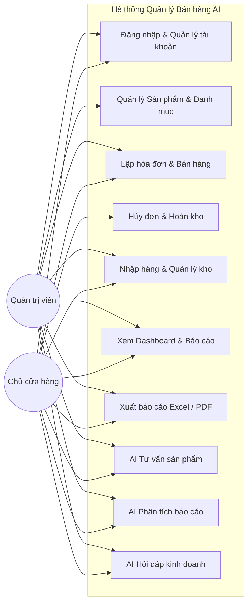
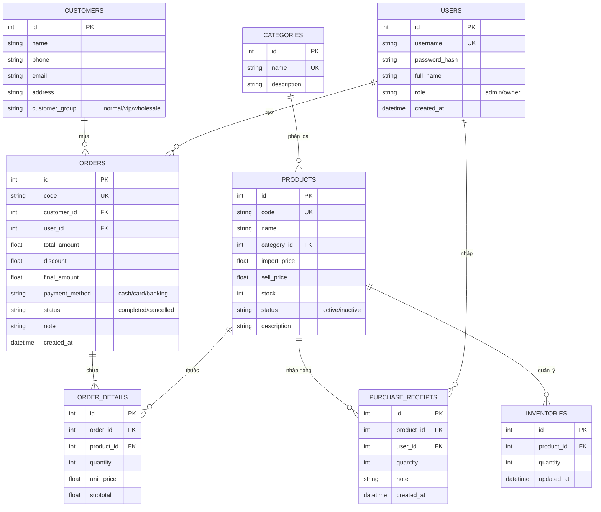
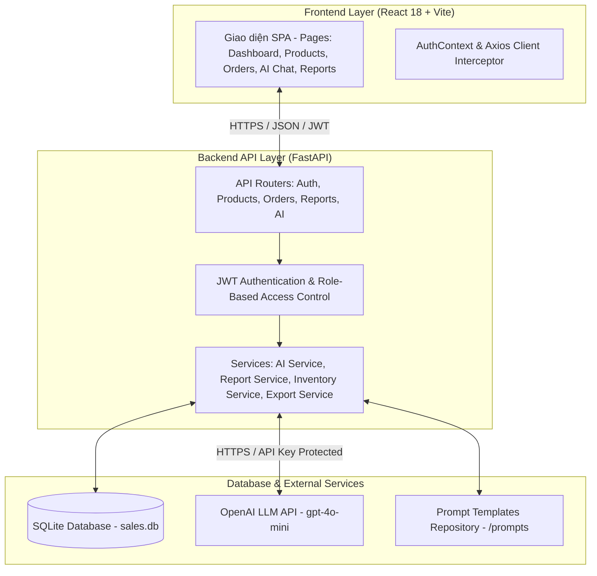

# BÁO CÁO BÀI KIỂM TRA THƯỜNG XUYÊN 1 (TX1)
## PHÂN TÍCH VÀ THIẾT KẾ HỆ THỐNG QUẢN LÝ BÁN HÀNG TÍCH HỢP AI

- **Học phần:** Ứng dụng trí tuệ nhân tạo (K23.K1.CNTT K23C)
- **Nhóm sinh viên:** Nhóm 03
- **Thành viên thực hiện:**
  - **Hoàng Trang Hiên** (Trưởng nhóm — Phân tích yêu cầu SRS, Thiết kế Kiến trúc & UML, Kỹ nghệ Prompt AI, Guardrails PII, Kịch bản Demo & Tổng hợp báo cáo)
  - **Nguyễn Viết Cường** (Lập trình viên chính — Phát triển Backend FastAPI, Frontend React 18, Tích hợp OpenAI/Gemini API, Xử lý giao dịch kho & Bộ kiểm thử Pytest)
- **Học kỳ:** 2026_2027_1
- **Giảng viên hướng dẫn:** ThS. Nguyễn Tuấn Anh (0912662003)
- **Cơ sở đào tạo:** Đại học Công nghệ Thông tin & Truyền thông (ICTU)
---

## 1. Phân tích bài toán quản lý
- **Bối cảnh:** Cửa hàng kinh doanh thiết bị công nghệ, phụ kiện điện tử cần một hệ thống quản lý tập trung từ bán hàng, kiểm soát tồn kho, lập đơn hàng, phân tích báo cáo doanh số và hỗ trợ nhân viên tư vấn khách hàng chính xác.
- **Đối tượng người dùng:**
  - *Quản trị viên (Admin):* Cấu hình hệ thống, quản lý tài khoản người dùng, phân quyền, quản lý toàn bộ dữ liệu.
  - *Chủ cửa hàng (Owner):* Quản lý bán hàng tại quầy (POS), quản lý kho/nhập hàng, theo dõi dashboard doanh thu, lợi nhuận, phân tích sản phẩm bán chạy/chậm, sử dụng AI phân tích báo cáo và hỏi đáp chiến lược kinh doanh.
- **Dữ liệu chính:** Danh mục, Sản phẩm, Tồn kho (Inventory), Khách hàng, Đơn hàng & Chi tiết đơn hàng, Phiếu nhập hàng (Purchase Receipts).
- **Quy trình nghiệp vụ cốt lõi:**
  1. *Quy trình bán hàng (POS):* Tiếp nhận yêu cầu -> Chọn sản phẩm -> Áp dụng giảm giá/chọn khách hàng -> Chọn phương thức thanh toán (Tiền mặt/Thẻ/Chuyển khoản) -> Trừ tồn kho tự động -> Xuất hóa đơn.
  2. *Quy trình nhập kho:* Lập phiếu nhập từ nhà cung cấp -> Tăng số lượng tồn kho tương ứng.
  3. *Quy trình tư vấn AI:* Khách hàng đưa ra nhu cầu -> Nhập vào AI Chat -> Hệ thống lọc sản phẩm còn hàng (`stock > 0`) -> AI đề xuất tối đa 3 sản phẩm phù hợp và giải thích lý do.
  4. *Quy trình phân tích kinh doanh:* Chủ cửa hàng chọn khoảng thời gian -> Hệ thống tổng hợp doanh số/top sản phẩm -> AI phân tích xu hướng và đề xuất phương án.

---

## 2. Yêu cầu chức năng (Functional Requirements)

| Mã | Tên chức năng | Đầu vào (Input) | Xử lý (Processing) | Đầu ra (Output) |
| :--- | :--- | :--- | :--- | :--- |
| **UC01** | Đăng nhập & Xác thực | Username, Password | Kiểm tra tài khoản, hash password, sinh JWT token | Access token, Thông tin user & quyền |
| **UC02** | Quản lý người dùng | Thông tin user, vai trò (admin/owner) | Kiểm tra quyền Admin, lưu/sửa/xóa user trong DB | Danh sách user, trạng thái cập nhật |
| **UC03** | Quản lý sản phẩm & danh mục | Mã SP, tên, giá nhập, giá bán, danh mục, tồn kho | Kiểm tra trùng mã, validate giá bán > 0, cập nhật DB | Danh sách SP, chi tiết SP |
| **UC04** | Lập hóa đơn bán hàng | Danh sách SP + SL, giảm giá, PTTT, khách hàng | Kiểm tra tồn kho đủ, trừ kho, tính tổng tiền, lưu đơn | Hóa đơn mã `ORD-YYYYMMDD-xxxx` |
| **UC05** | Hủy đơn hàng | Mã đơn hàng cần hủy | Kiểm tra trạng thái đơn, hoàn lại tồn kho cho các sản phẩm | Đơn chuyển sang `cancelled`, tồn kho cập nhật |
| **UC06** | Nhập hàng (Purchase) | Mã SP, số lượng nhập, ghi chú | Tăng tồn kho tương ứng, ghi log phiếu nhập | Phiếu nhập hoàn tất, kho cập nhật |
| **UC07** | Báo cáo doanh thu & Kho | Khoảng ngày bắt đầu/kết thúc, nhóm theo ngày/tháng | Tổng hợp doanh thu, đếm đơn hàng, tìm top bán chạy / bán chậm | Bảng số liệu, biểu đồ, file Excel/PDF/CSV |
| **UC08** | AI Tư vấn sản phẩm | Yêu cầu của khách hàng | Che giấu SĐT, nạp DB sản phẩm còn hàng (`stock > 0`), gọi LLM | 1-3 gợi ý sản phẩm phù hợp kèm lý do |
| **UC09** | AI Phân tích báo cáo | Khoảng thời gian phân tích | Tổng hợp số liệu doanh thu/top SP, gửi vào prompt AI | Nhận xét chi tiết, xu hướng và đề xuất |
| **UC10** | AI Hỏi đáp kinh doanh | Câu hỏi của quản lý | Trích xuất ngữ cảnh kinh doanh, gọi LLM phân tích | Câu trả lời phân tích dựa trên dữ liệu |

---

## 3. Yêu cầu phi chức năng (Non-Functional Requirements)
1. **Bảo mật (Security):**
   - Mật khẩu được mã hóa bằng thuật toán `bcrypt` an toàn.
   - Xác thực API thông qua chuẩn `JWT (JSON Web Token)` với thời hạn hết hạn được kiểm soát.
   - API Key của OpenAI được bảo vệ hoàn toàn tại backend thông qua biến môi trường `.env`, không bao giờ lộ ra frontend.
   - Áp dụng cơ chế **Data Masking** tự động che giấu số điện thoại và thông tin nhạy cảm của khách hàng trước khi gửi tới OpenAI API.
2. **Hiệu năng & Độ trễ (Performance):**
   - API Backend viết bằng FastAPI (Asynchronous & Non-blocking I/O), thời gian phản hồi trung bình < 100ms với các truy vấn CRUD.
   - Tích hợp timeout (`AI_TIMEOUT_SECONDS = 30s`) và giới hạn tần suất gọi AI (`Rate Limiting = 12 calls/min`) để bảo vệ tài nguyên.
3. **Khả dụng & Toàn vẹn dữ liệu (Data Integrity):**
   - Sử dụng Transaction trong SQLAlchemy: Tạo đơn hàng và trừ kho diễn ra trong cùng một transaction để tránh lệch dữ liệu kho.
   - Ràng buộc khóa chính, khóa ngoại, kiểu dữ liệu và kiểm tra validation chặt chẽ bằng Pydantic.
4. **Trải nghiệm người dùng (UX/UI):**
   - Giao diện SPA (Single Page Application) nhanh, mượt mà với React 18 + Vite.
   - Thiết kế trực quan, thông báo lỗi rõ ràng khi nhập sai dữ liệu hoặc thiếu tồn kho.

---

## 4. Thiết kế Actor và Use Case

---

## 5. Thiết kế Cơ sở dữ liệu (ERD & Quan hệ bảng)

---

## 6. Thiết kế Kiến trúc Hệ thống

---

## 7. Vị trí ứng dụng AI trong hệ thống
Hệ thống xác định rõ 3 điểm chạm (Touchpoints) thực sự cần AI giải quyết:
1. **AI Trợ lý tư vấn sản phẩm tại quầy:** Nhân viên không thể nhớ hết toàn bộ thông số kỹ thuật và trạng thái còn hàng của hàng trăm mặt hàng. AI đóng vai trò như chuyên gia tư vấn tức thì.
2. **AI Phân tích báo cáo kinh doanh:** Biến các bảng số liệu doanh thu khô khan thành các đoạn nhận xét định tính, chỉ ra mặt hàng bán chạy, mặt hàng ứ đọng vốn và khuyến nghị nhập hàng.
3. **AI Trợ lý điều hành (Q&A):** Cho phép chủ cửa hàng đặt các câu hỏi tự nhiên về tình hình kinh doanh để nhận phân tích tức thì.

---

## 8. Thiết kế Prompt và Luồng gọi AI sơ bộ
- **Nguyên tắc thiết kế Prompt:** Tách biệt hoàn toàn code logic và nội dung Prompt; sử dụng placeholder `{{biến}}` để inject dữ liệu từ database.
- **Ràng buộc an toàn:**
  - Chỉ tư vấn sản phẩm có trong danh sách được truyền vào (Grounding).
  - Nghiêm cấm gợi ý sản phẩm có tồn kho = 0.
  - Tự động che giấu số điện thoại khách hàng bằng Regex Masking.

---

## 9. Minh chứng sử dụng AI trong giai đoạn Phân tích & Thiết kế
- **Prompt sử dụng với AI (Giai đoạn 1):** *"Tôi cần xây dựng hệ thống quản lý bán hàng thiết bị công nghệ cho cửa hàng nhỏ, có tích hợp AI tư vấn. Hãy gợi ý mô hình cơ sở dữ liệu và các use case chính."*
- **Phản hồi từ AI:** Đề xuất 7 bảng cơ bản và sơ đồ quan hệ.
- **Kiểm chứng & Chỉnh sửa của nhóm:** Nhóm phát hiện thiết kế ban đầu thiếu quản lý lịch sử tồn kho và phiếu nhập hàng, nhóm đã bổ sung bảng `inventories` và `purchase_receipts` để hỗ trợ tính năng hoàn kho khi hủy đơn.

---

## 10. Kế hoạch triển khai các giai đoạn tiếp theo
1. **Giai đoạn 2 (TX2):** Lập trình Backend FastAPI, kết nối SQLite, hoàn thiện CRUD, phân quyền JWT và xây dựng Frontend React.
2. **Giai đoạn 3 (TX3):** Tích hợp OpenAI API, thử nghiệm và tối ưu hóa 3 phiên bản Prompt, viết bộ test tự động (Pytest) và xử lý Rate Limit/Masking.
3. **Giai đoạn 4 (KTHP):** Đóng gói, hoàn thiện tài liệu kỹ thuật, chuẩn bị kịch bản demo và kiểm thử toàn diện.
