# 📊 SƠ ĐỒ THIẾT KẾ HỆ THỐNG QUẢN LÝ BÁN HÀNG TÍCH HỢP AI (AIA331)

> **Học phần:** Ứng dụng trí tuệ nhân tạo (K23.K1.CNTT K23C)  
> **Dự án:** Hệ thống Quản lý Bán hàng Tích hợp Trợ lý AI  
> **Nhóm thực hiện:** Nhóm 03 (Hoàng Trang Hiên & Nguyễn Viết Cường) | **GVHD:** ThS. Nguyễn Tuấn Anh  
> **Đặc tả:** Mô hình hệ thống tinh gọn gồm 2 Actor (Admin, Owner) và 7 bảng CSDL thực tế.

---

## 📑 MỤC LỤC CÁC SƠ ĐỒ CỐT LÕI

1. [Sơ đồ Use Case & Phân quyền (2 Actor: Admin, Owner)](#1-sơ-đồ-use-case--phân-quyền)
2. [Sơ đồ Quan hệ Thực thể CSDL (ERD - 7 Bảng Cốt lõi)](#2-sơ-đồ-quan-hệ-thực-thể-csdl-erd)
3. [Sơ đồ Kiến trúc Hệ thống 3 tầng (System Architecture)](#3-sơ-đồ-kiến-trúc-hệ-thống)
4. [Sơ đồ Luồng Hoạt động (Activity Diagrams)](#4-sơ-đồ-luồng-hoạt-động-activity-diagrams)
5. [Sơ đồ Tuần tự (Sequence Diagrams)](#5-sơ-đồ-tuần-tự-sequence-diagrams)
6. [Sơ đồ Luồng Dữ liệu (DFD Cấp 0 & Cấp 1)](#6-sơ-đồ-luồng-dữ-liệu-dfd)
7. [Sơ đồ Lớp Backend (Class Diagram)](#7-sơ-đồ-lớp-backend-class-diagram)
8. [Sơ đồ Chuyển trạng thái Đơn hàng (Order State Machine)](#8-sơ-đồ-chuyển-trạng-thái-đơn-hàng)

---

## 1. Sơ đồ Use Case & Phân quyền

Hệ thống được thiết kế tối giản, phân quyền rõ ràng cho 2 nhóm đối tượng:
- **👨‍💼 Quản trị viên (Admin):** Quản trị tài khoản, phân quyền, quản lý danh mục, sản phẩm, kho hàng, xem toàn bộ báo cáo và sử dụng AI.
- **👔 Chủ cửa hàng (Owner):** Trực tiếp quản lý bán hàng (POS), nhập hàng, theo dõi dashboard doanh thu và sử dụng trợ lý AI phân tích điều hành.

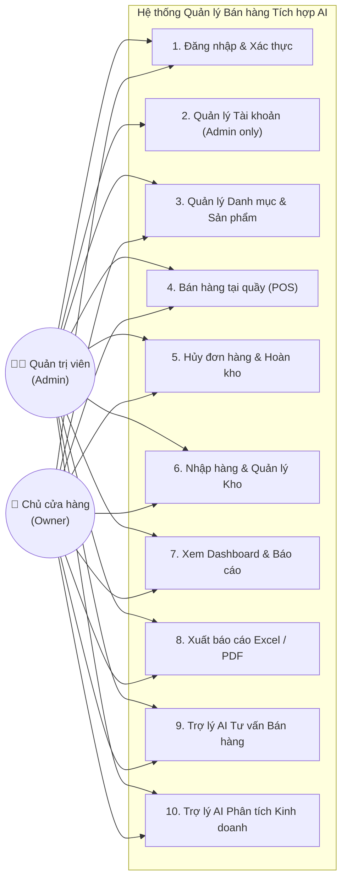

---

## 2. Sơ đồ Quan hệ Thực thể CSDL (ERD)

Mô hình CSDL thực tế gồm **7 bảng cốt lõi** phục vụ đầy đủ quy trình bán lẻ POS, quản lý xuất nhập tồn kho và trợ lý AI:

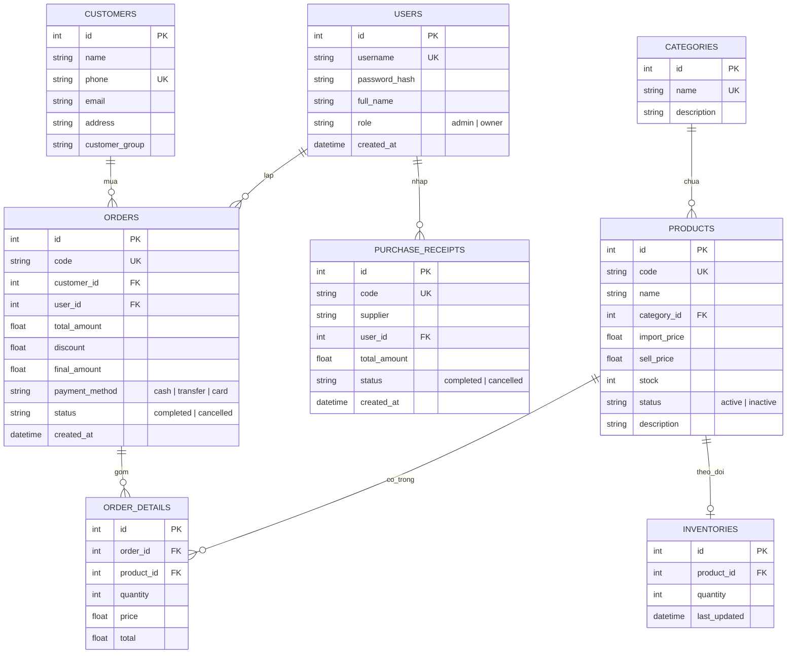

---

## 3. Sơ đồ Kiến trúc Hệ thống

Kiến trúc 3 tầng chuẩn hiện đại, phân tách rõ ràng giữa Giao diện, Backend API và Tầng Trí tuệ Nhân tạo:

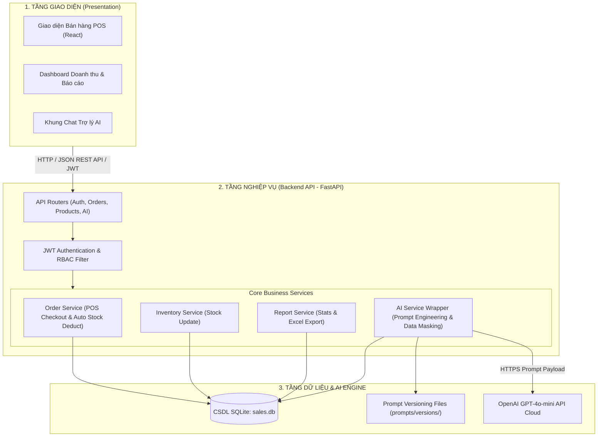

---

## 4. Sơ đồ Luồng Hoạt động (Activity Diagrams)

### 4.1. Luồng Bán hàng POS & Trừ tồn kho tự động
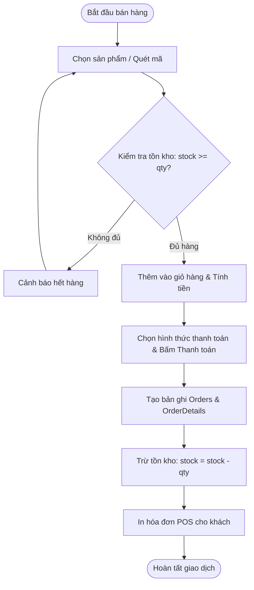

### 4.2. Luồng Trợ lý AI Tư vấn & Bảo vệ dữ liệu (Data Masking)
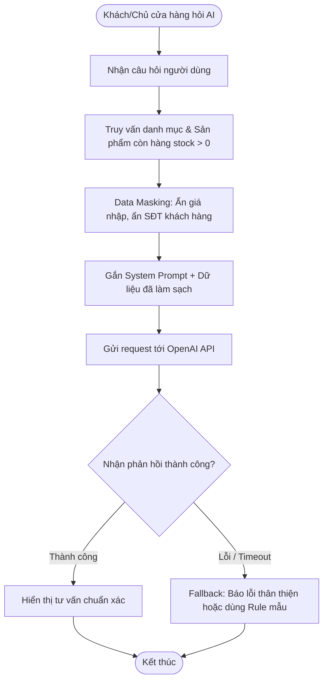

---

## 5. Sơ đồ Tuần tự (Sequence Diagrams)

### 5.1. Tuần tự Đăng nhập & Xác thực JWT
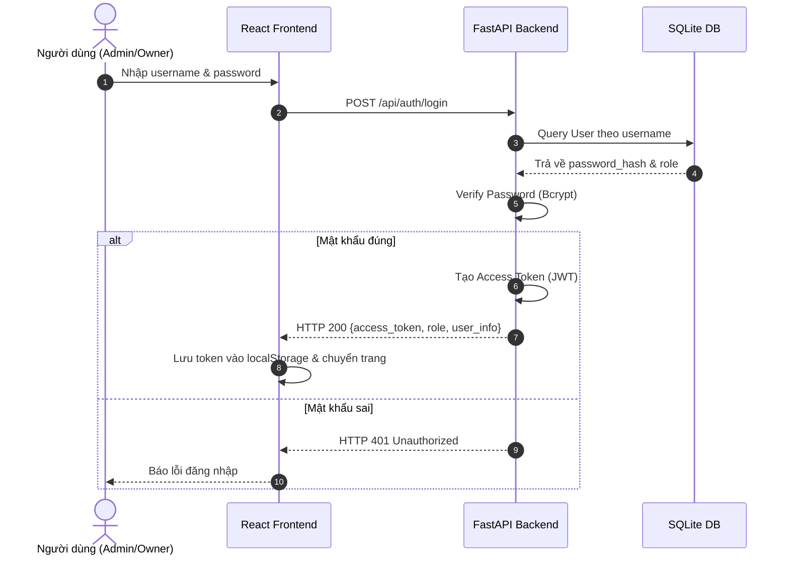

### 5.2. Tuần tự Bán hàng POS & Tạo Hóa đơn
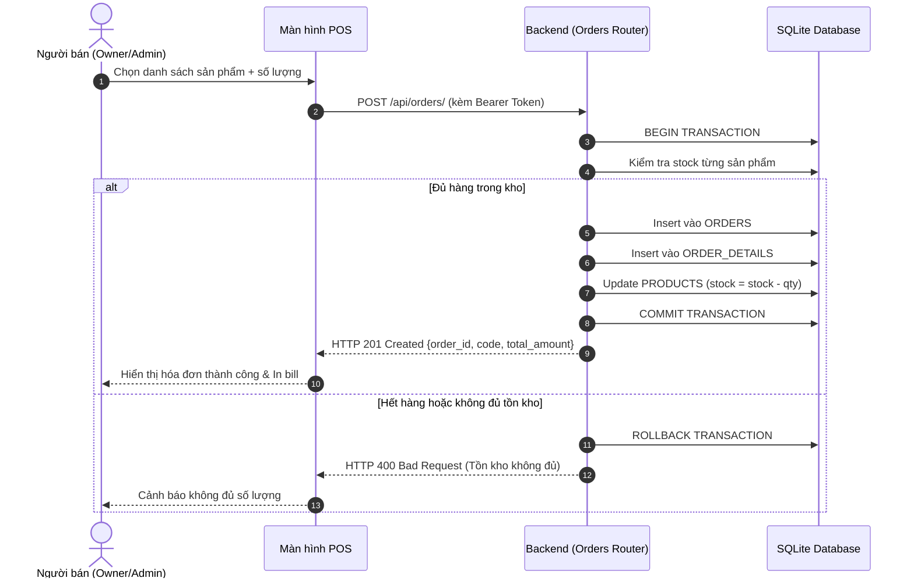

---

## 6. Sơ đồ Luồng Dữ liệu (DFD)

### DFD Cấp 0 (Sơ đồ Ngữ cảnh)
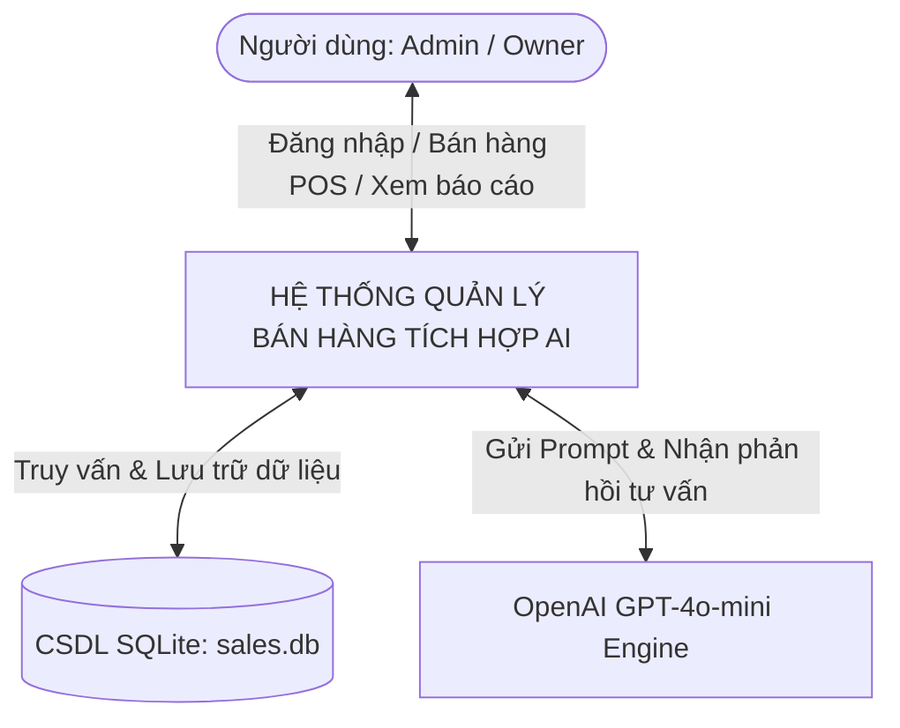

### DFD Cấp 1 (Phân rã chức năng)
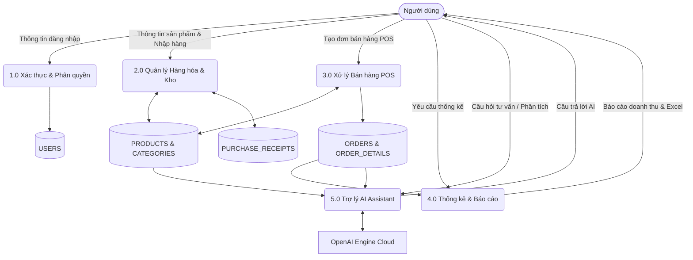

---

## 7. Sơ đồ Lớp Backend (Class Diagram)

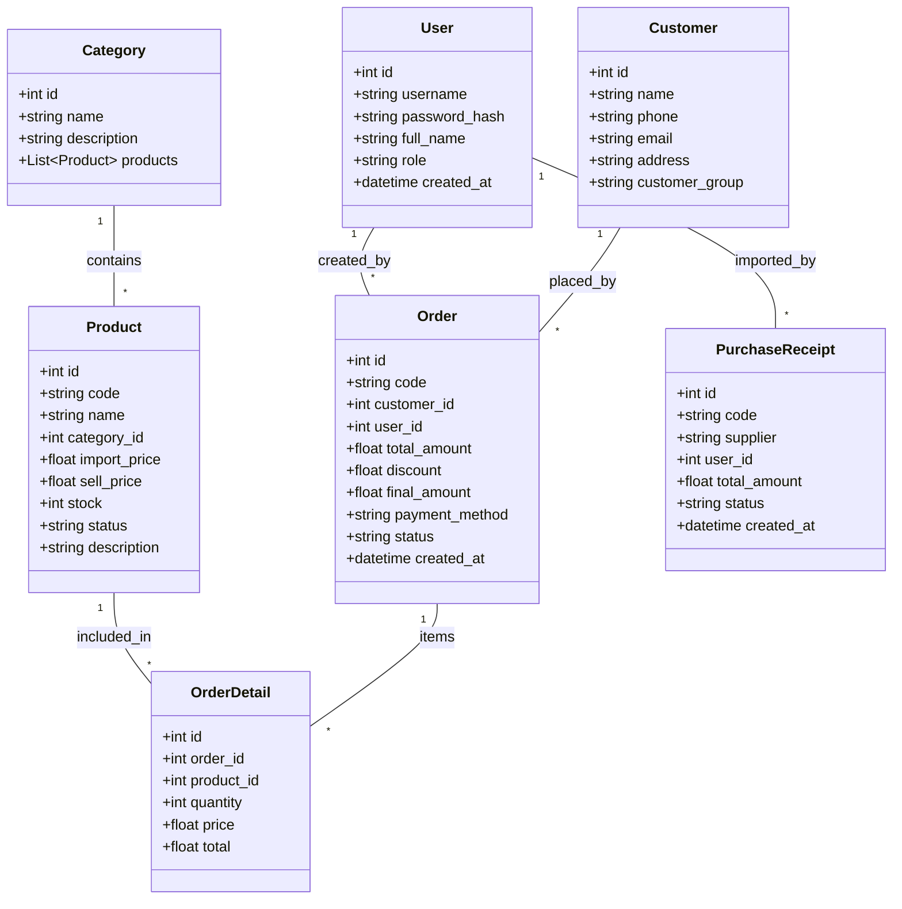

---

## 8. Sơ đồ Chuyển trạng thái Đơn hàng

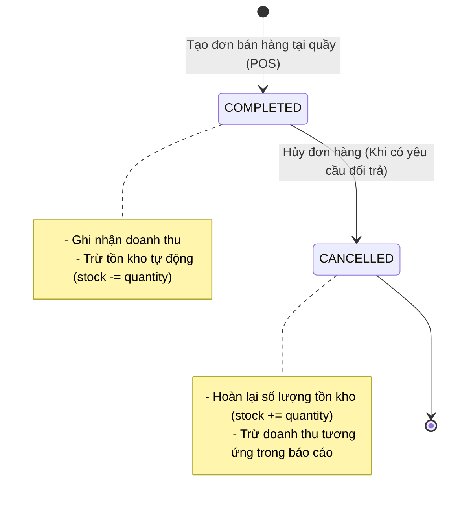
